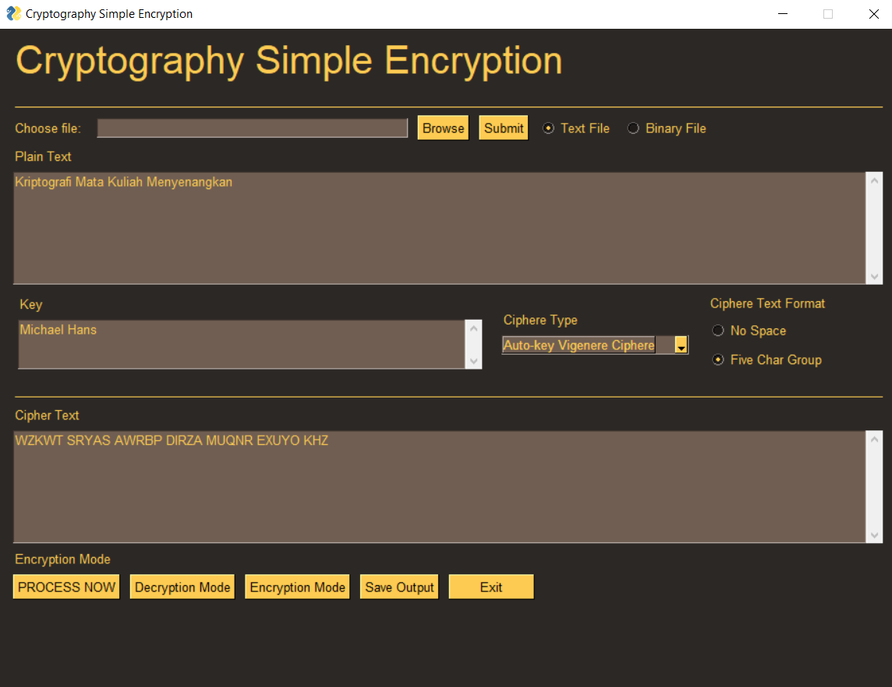

# Tugas Kecil 1: Kriptografi

## Fitur Program
Melakukan enkripsi dan dekripsi sebuah *text file* atau *binary file* dengan algoritma sebagai berikut.
* Vigenere Ciphere (26 alphabet)
* Full Vigenere Ciphere (26 alphabet)
* Auto Key Vigenere Ciphere (256 karakter ASCII)
* Extended Vigenere Ciphere (26 alphabet)
* Playfair Ciphere (26 alphabet)
* Affine Ciphere (26 alphabet)
* Hill Ciphere (26 alphabet)

## Tampilan Antarmuka Program


## Requirements
* PySimpleGUI module (install via ```pip install pysimplegui```)
* Numpy module (install via ```pip install numpy```)
* Python 3.7 or newest version

### How to Run
1. Go to directory ./src from root directory
2. Run the command prompt from there
3. Run the command below
   ```
   python gui.py
   ```
4. The application will be show up.

## How to Use
| Feature               | Description                                                                      |
| --------------------- | ----------------------------------------------------------------------------- |
| File browse           | upload file from text or binary file                                          |
| File type             | choose the type of the file                                                   |
| Input box             | Plaintext that will be encrypted / Ciphertext that will be decrypted          |
| Key                   | the key that using in the encryption / decryption                             |
| Ciphere type          | select the type of encryption-decryption algorithm                            |
| Ciphere text format   | return the cipher format as the user choice type                              |
| Process Now           | run the encryption or decryption from the input text                          |
| Decryption Mode       | navigate to decryption mode                                                   |
| Encryption Mode       | navigate to encryption mode                                                   |
| Save Output           | save the output text from the output box to the file with given name          |
| Exit                  | exit the program                                                              |
| Output file           | all saved file will be output to the dump folder                              |

### Acknowledgments
* Rinaldi Munir who give the lecture ryptography
* Zunan and Dean as Cryptography Assistant

### Author
* Hengky Surya Angkasa / 13518048
* Michael Hans / 13518056